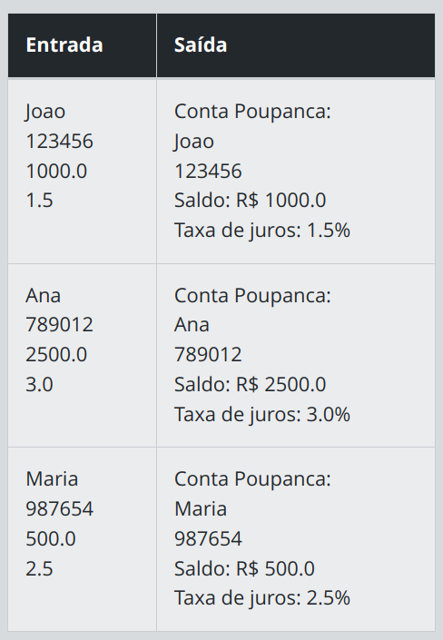

# Desafio: Herança Bancária
Após o sucesso no desenvolvimento do sistema básico de abertura de contas bancárias, o banco decidiu expandir seus serviços para oferecer diferentes tipos de contas. Agora, além das contas bancárias comuns, eles também oferecem contas poupança. Sua tarefa é implementar a herança e o polimorfismo no sistema, criando uma classe "ContaPoupanca" que herde da classe "ContaBancaria" anteriormente criada. A classe "ContaPoupanca" deve adicionar um novo atributo, taxa de juros, além dos atributos herdados.

## Dica: 
Utilize a herança para criar a classe "ContaPoupanca" que herde da classe "ContaBancaria" e adicione o atributo "taxaJuros". Implemente o método "exibirInformacoes()" na classe "ContaPoupanca" para exibir as informações adicionais.

## Entrada
O programa deve solicitar ao usuário as informações necessárias para abrir uma conta poupança. A entrada deve ser feita via console (linha de comando) e deve incluir o número da conta (um valor inteiro), o nome do titular (uma sequência de caracteres), o saldo inicial da conta (um valor decimal) e a taxa de juros da conta poupança (um valor decimal).

## Saída
Após receber as informações da conta poupança, o programa deve criar um objeto do tipo "ContaPoupanca" e exibir na tela as informações dessa conta, incluindo o número da conta, o nome do titular, o saldo atual e a taxa de juros. A saída deve ser formatada de forma clara e legível para o usuário.

## Exemplos
A tabela abaixo apresenta exemplos com alguns dados de entrada e suas respectivas saídas esperadas. Certifique-se de testar seu programa com esses exemplos e com outros casos possíveis.

